# Array List Manipulation

## General Overview
This is a project I did in my second semester of my software development course. it consists of a random set of integers in an array and a series of different functions that the user can choose from on a text-based menu.

## App Functions

### Start Up
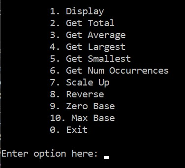
### Display Option
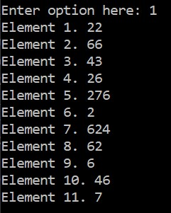
### Get Total
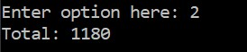
### Get Average
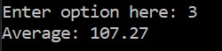
### Get Largest
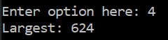
### Get Smallest
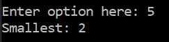
### Get Number Frequency
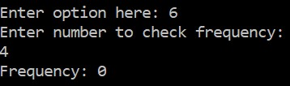
### Scale Up
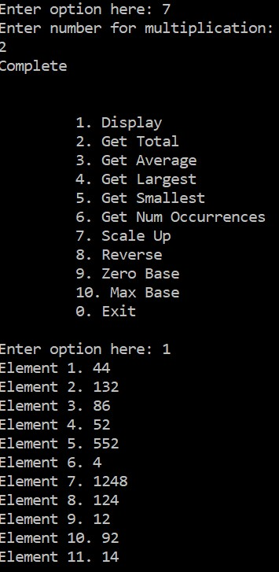
### Zero Base
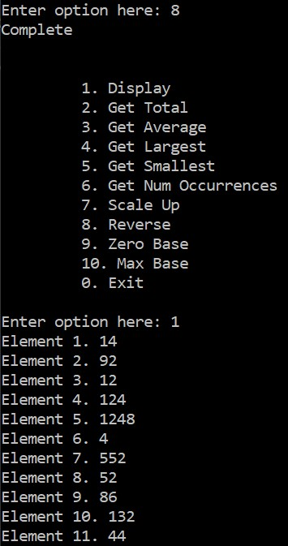
### Max Base
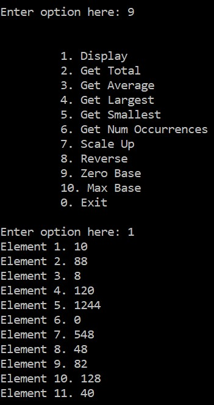
### Exit
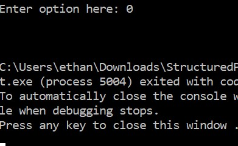

## Check Out The Code
Here is a [Paste Bin](https://pastebin.com/DCNHA1qN) link to the source code.
