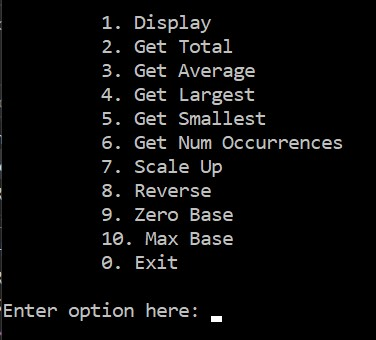
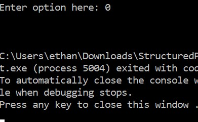

#Array List Manipulation

##General Overview
This is a project I did in my second semester of my software development course. it consists of a random set of integers in an array and a series of different functions that the user can choose from on a text-based menu.

##App Functions

###Start Up

###Option 1

